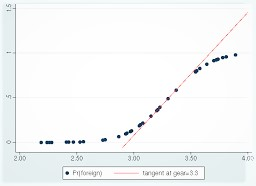
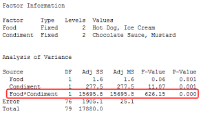
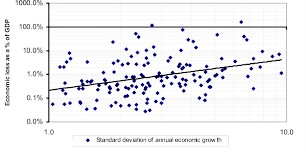
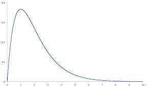

# Linear-Regression-and-its-assumptions

INTRO to LIN-REG:
-----

The Linear regression analysis is the most used of all statistical techniques and it is the first and foremost concept that we learn and practice in our way to conquer advanced machine learning techniques.

>*#For people new to the word __"Regression"__:
>*__Regression__*is the art and science of fitting a straight line to pattern of data points.

In linear regression model the *__'variable of interest'__*, commonly knows as *__'dependent variable'__* is predicted from *__k__* other variables called as *__'independent variables'__* using a __linear equation__. If __Y__ denotes the variable of interest (the so-called dependent variable) and __X1, …, Xk,__ are the independent variables, the assumption is that the value of __Y__ at time __t__ (or row __t__) in the data sample is determined by the linear equation: 

where 
- __β__ s are the constants
- __epsilons__ are independent and identically distributed (i.i.d.)
normal random variables with mean zero (the “noise” in the system).
- __β0__ is the __intercept of the model__ —the expected value of __Y__ when all the __X’s__ are zero
- __βi__ is the coefficient (multiplier) of the variable Xi 

The __β__ s together with the __mean and standard deviation of the epsilons__ are the __*parameters*__ of the model. 

The corresponding equation for *predicting __Yt__ from the corresponding values of the __X’s__ is therefore:*

where
- __b’s__ are estimates of the __β__ s obtained by *least-squares*, i.e., minimizing the squared
prediction error within the sample. 

This is a simplest possible model for predicting one variable from a group of others, and it rests on the following assumptions.

## Assumptions of Linear Regession

__1. The expected value of Y is a linear function of the X variables. This means:__
- if Xi changes by an amount ∆Xi, holding other variables fixed, then the expected
value of Y changes by a proportional amount βi∆Xi, for some constant βi (which
in general could be a positive or negative number).
- The value of βi is always the same, regardless of values of the other X’s.
- The total effect of the X’s on the expected value of Y is the sum of their separate
effects.

__2. The unexplained variations of Y are independent random variables (in particular, not
“autocorrelated” if the variables are time series)__

__3. They all have the same variance (“homoscedasticity”).__

__4. They are normally distributed.__

### You can easily imagine many situations in the real world problems that may not satisfy all/some of the assumptions listed above.

- __Y__ might be a non linear function of __X's__.
    - e.g., if there are diminishing marginal effects
 
    
    
- **There might be interactions among the X’s in their effects on Y**
    - e.g., if the sensitivity of Y to one ofthe X’s depends on the values of other X’s
    
    
    
- **Some cases in which the size of the random deviations of Y from its expected value might depend on the values of the X’s** 
    - e.g., if there is greater or lesser uncertainty under some conditions
    
    
    
- **The random deviations might be correlated in time, or in which the errors are not normally distributed.**
    - e.g., The error distribution might not be bell-shaped and/or might have some really extreme values.
    
    

## A regression model assumes that there are no such _nonlinearities or interactions or changing volatility or autocorrelation or nonnormality_ in the random variations.

> ***_A regression model does not assume that Y merely “depends in some way” on the X’s. If you have a variable Y that you wish to predict, and you have some other variables X1, X2, etc., that you believe have “some sort of effect” on Y or “some sort of predictive
value” with respect to future values of Y, this does NOT suffice to justify using a linear regression model to predict Y from the X’s._***

>***_The regression model makes very strong assumptions about the WAY in which Y depends on the X’s, namely that the causal or predictive effects of the X’s with respect to Y are linear and additive and non-interactive and that any variations in Y that are not explained by the X’s are statistically independent of each other and identically normally distributed under all conditions._*** 
